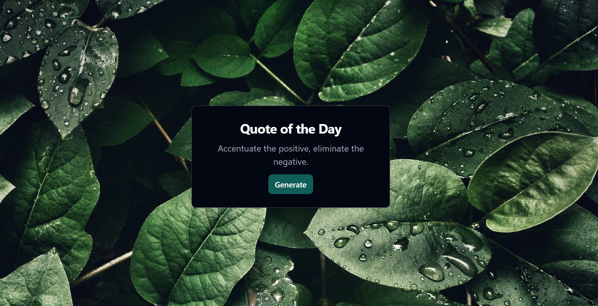

# React App with Vite



This React app was created using Vite and is hosted on Netlify. The live site can be accessed at [bucolic-rolypoly-9887ea.netlify.app](https://bucolic-rolypoly-9887ea.netlify.app/).

## Features

- Random advice generation
- Clean and responsive design
- Built with Vite for fast development

## Getting Started

To run this project locally, follow these steps:

1. **Clone the repository:**

   ```bash
   git clone https://github.com/your-username/your-repo.git
   ```
